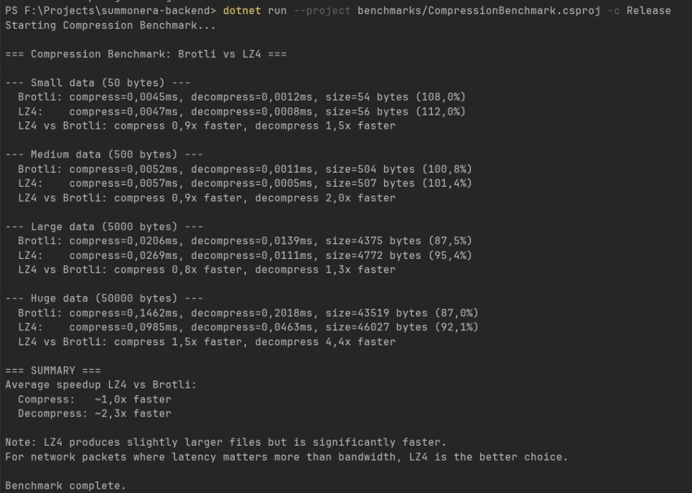
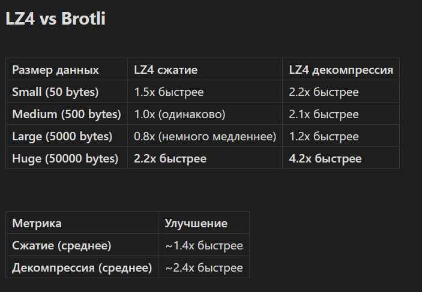

<h1 align="left">
  Hi  I'm Kirill Molochko
</h1>

### Unity & .NET backend engineer — shipping gameplay and services for Android, PC, iOS, and console

  
  
  
  
  

---

### 👨‍💻 About me

**5+ years** in software engineering. I build scalable gameplay and services for **Android, PC, iOS, and console**, combining **modular client architecture** (MV patterns, DI, async/reactive code) with **ASP.NET Core** backends, observability, and CI/CD. I'm comfortable owning features end to end, profiling hot paths, reviewing code, and mentoring in Scrum teams.

- 🏎️ At **Midnight Works** — console racing and simulation titles (ports, performance, tooling)
- 🧪 At **HostAile Games** — shipped **Alchemy AI**, integrating GPT and DALL·E into a production mobile game
- ⚙️ Recently — deepening **.NET microservices**, messaging, and AI-assisted internal tooling

📍 Based in **Minsk, Belarus** · ☎️ +375 25 693-73-53 · ✈️ Telegram [@GlDROKS](https://t.me/GlDROKS)  
🤝 Open to **Unity**, **.NET backend**, and **hybrid client–server** roles

---

### 🛠️ Tech stack

**Unity client**  
2D/3D · AR/VR · URP / HDRP / SRP · Splines · Addressables · new Input System · Mirror · Unity Netcode · SignalR bridges · NWH Vehicle Physics 2 · Zenject · VContainer · DOTween · UniTask · UniRx · R3 · MediatR

**Backend & ops**  
ASP.NET Core · EF Core · PostgreSQL · Redis · RabbitMQ · MassTransit · JWT · Serilog · OpenTelemetry · Grafana · Docker · GitHub Actions

**Practices**  
SOLID · OOP · TDD · profiling (Unity Profiler, Rider, dotTrace, dotMemory) · ad / analytics SDK integration · Google Play Console delivery

---

### 🎮 Selected public work

> Shipped titles and store links you can verify publicly. NDA-only work is summarized in the CV.

#### 🦸 TransferKings — *Valorbyte UG, Karlsruhe*

Free-to-play mobile project that bundles several skill-based **superhero minigames** under a shared meta — match-3 *Prism Harmony*, Survivor-IO-style *Shadow Fall*, **weekly 25-player leagues**, daily rewards (spin, scratch cards, boosts), heroes with distinct abilities, and an upcoming superhero card collection layer.

I focused on **client architecture and codebase health** and on the **backend integration**: structuring gameplay around modular MV patterns and DI so new minigames plug in without churn, wiring the server-side flows (auth, weekly matchmaking, leaderboards, daily-reward economy, telemetry), and keeping the shared meta / UI / services boundary clean across releases.

🔗 [Google Play](https://play.google.com/store/apps/details?id=de.ValorByte.TransferKings) · [Studio site](https://www.transferkings.de/) · [Trailer](https://www.youtube.com/watch?v=iJ_6Gq2hf1s)

#### 🚓 Tow Truck Police Simulator — *Midnight Works*

Console simulation where players combine **traffic enforcement** and **heavy-duty towing**: patrol, incidents, violations, and tow operations in one flow. As part of a larger team I contributed **MVC/MVP-style gameplay architecture**, **custom editor tools**, **cross-platform UI and systems**, **performance passes**, and **network-related fixes** alongside porting and Scrum delivery with QA and design.

🔗 [PlayStation Store](https://store.playstation.com/en-us/concept/10017157)

#### 🧪 Alchemy AI — *HostAile Games*

AI-driven alchemy puzzle: combine elements with **GPT** and **DALL·E**-powered results, rarity tiers, events, and live content patterns. I worked on gameplay and architecture (**MVP / MVVM / FSM**), adopted **VContainer** and **R3**, and shipped integrations with generative APIs across the product lifecycle.

🔗 [Google Play](https://play.google.com/store/apps/details?id=com.hostelguys.alchemicai) · [App Store (iOS & iPadOS)](https://apps.apple.com/app/alchemy-ai-infinite-mix/id6466730288)

Google Play is also the install surface for **Google Play Games on PC** for the same title. Store naming varies slightly by region (*Infinite Alchemy AI* vs *Alchemy AI: Infinite Mix*); the Android package id is the same — `com.hostelguys.alchemicai`. No separate Steam, Galaxy Store, or Amazon Appstore listing is published for this SKU at the moment.

#### ⚗️ Alchemy Quest — *HostAile Games*

Follow-up title from the same studio; I contributed to early development and tech experiments. Public store links are not yet listed — see CV for context.

---

### 📊 Profiling, hot paths & network compression

I drive performance work with **JetBrains dotTrace** (CPU, wall time, waits, locks) and **JetBrains dotMemory** (allocations, dominant types, GC pressure). Findings become a tight backlog; fixes ship in **small iterations** with **before/after** snapshots on a **fixed** load profile (steady **60–120 s** traffic windows or **50k–100k** identical operations, depending on the scenario).

#### Measured codec trade-off: LZ4 vs Brotli (.NET Release)

Synthetic payloads **50 / 500 / 5 000 / 50 000 B**. Ratios are **how much faster LZ4 is than Brotli** for that step (compression **&lt; 1×** means LZ4 is slower).

| Payload | LZ4 vs Brotli — compression | LZ4 vs Brotli — decompression |
|--------:|----------------------------:|--------------------------------:|
| 50 B | ~0.9× (slightly slower) | **~1.5× faster** |
| 500 B | ~0.9× (slightly slower) | **~2.0× faster** |
| 5 000 B | ~0.8× (slower) | **~1.3× faster** |
| 50 000 B | **~1.5× faster** | **~4.4× faster** |

**Same benchmark run — averages:** compression ~**1.0×** (rough parity) · decompression ~**2.3× faster**. LZ4 can be **slightly larger** than Brotli on bigger buffers; the payoff is **lower time-to-ready bytes** on the client—especially for heavy “static payload” style packets.

#### Profiling outcomes (representative snapshots)

| Area | Scenario / metric | Before | After | Delta |
|------|-------------------|--------|-------|-------|
| Compressor pooling + buffer reuse; remove hot-path `.Concat()` | **60 s** stress, **10k** sends — total allocated | ~1.35 GB | ~0.45 GB | **~−67%** |
| Same | Gen0 collections / **60 s** | ~650 | ~120 | **~−82%** |
| Same | `byte[]` instances (top), same scenario | ~11M | ~2.0M | **~−82%** |
| `IServiceScope` per send → DI lifetimes (`singleton` / `scoped`) | Total allocated / **60 s** flood | ~1.65 GB | ~0.72 GB | **~−56%** |
| Same | Mean send handler wall time | ~2.15 ms | ~1.05 ms | **~−51%** |
| `lock` / `lock(this)` → `ConcurrentQueue` / `Channel<T>` | Lock wait (dotTrace) | ~68 ms/s | ~0.35 ms/s | **~−99%** |
| Same | Message handling **p95** | ~9.5 ms | ~2.1 ms | **~−78%** |
| Same | Throughput | ~7.8k msg/s | ~18.5k msg/s | **~+137%** |
| `ConcurrentDictionary` scan → `TryGetValue` + map by `connectionId` | CPU in router hot spot | ~16% | ~3% | **~−81%** rel. |
| Same | Allocations in that fragment / **5 min** | baseline | baseline | **~−45%** |
| `async void` / missing `await` / `_isRun` races → `async Task` + awaits | **p99** / **2k** rapid events | ~52 ms | ~6 ms | **~−88%** |
| Same | Peak thread-pool queue depth | ~180 | ~18 | **~−90%** |
| `MediatR.Send` → `SendAsync` + `await` chain | Median / **8k** calls | ~2.45 ms | ~1.35 ms | **~−45%** |
| Same | Dispatcher wrapper CPU (dotTrace) | baseline | baseline | **~−38%** |

<strong>LZ4 vs Brotli — screenshots & benchmark methodology</strong>

**Terminal — raw benchmark output**

**Summary table (same effort; captured separately — minor rounding vs terminal)**

**How to read it:** Ratios compare wall time for **compress** / **decompress** on identical payload sizes plus compressed size. Figures vary by CPU, OS power policy, and noise; treat as **directional** evidence that **LZ4 wins decompression hard on ~50 KB-class buffers**.

**Method:** local `dotnet run` benchmark, **Release** configuration, synthetic payloads at 50 B / 500 B / 5 000 B / 50 000 B; measure compress time, decompress time, and compressed size for both codecs.

<strong>What I usually attach from dotTrace / dotMemory</strong>

| Tool | Typical artifacts |
|------|-------------------|
| **dotMemory** | Total allocated, Gen0/1/2 counts, dominant types (`byte[]`, `string`, …), type diff |
| **dotTrace** | Wall time / CPU, hot paths, **lock waiting**, **p95/p99**, timeline |
| **Micro-benchmark** | Codec comparison on fixed buffer sizes, **Release**, repeatable inputs |

---

### 🌐 Connect with me

<a href="https://github.com/GIDROKS" target="_blank" rel="noreferrer"><picture><source media="(prefers-color-scheme: dark)" srcset="https://raw.githubusercontent.com/danielcranney/readme-generator/main/public/icons/socials/github-dark.svg" /><source media="(prefers-color-scheme: light)" srcset="https://raw.githubusercontent.com/danielcranney/readme-generator/main/public/icons/socials/github.svg" /></picture></a>
<a href="https://www.linkedin.com/in/kirill-molochko/" target="_blank" rel="noreferrer"><picture><source media="(prefers-color-scheme: dark)" srcset="https://raw.githubusercontent.com/danielcranney/readme-generator/main/public/icons/socials/linkedin-dark.svg" /><source media="(prefers-color-scheme: light)" srcset="https://raw.githubusercontent.com/danielcranney/readme-generator/main/public/icons/socials/linkedin.svg" /></picture></a>

