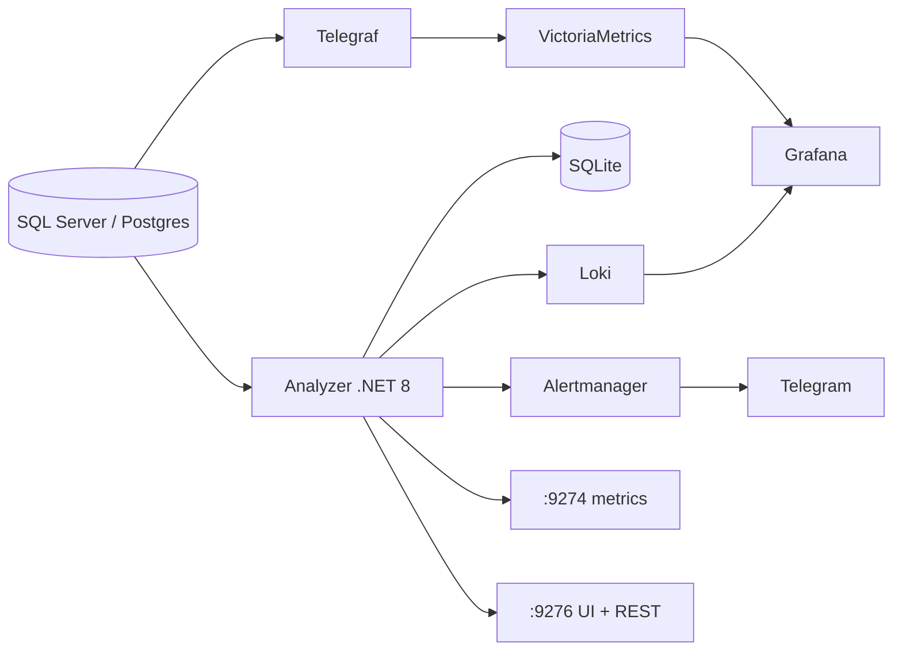
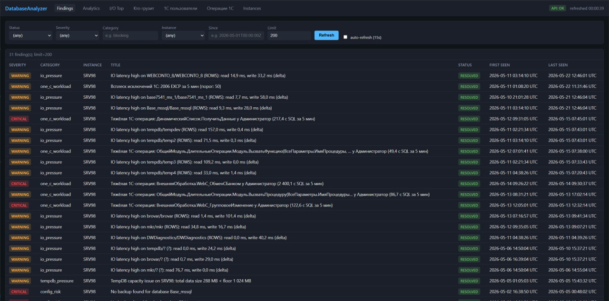
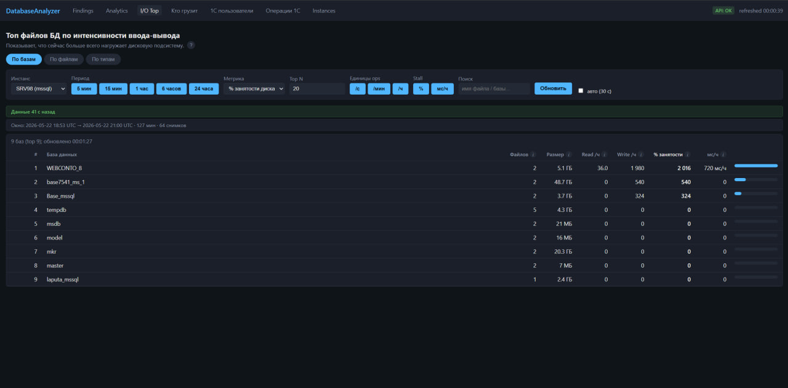
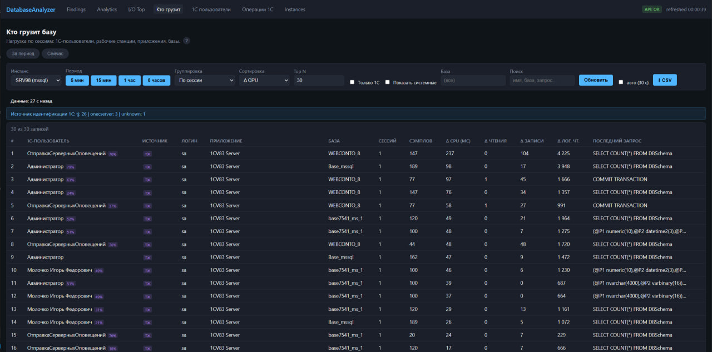
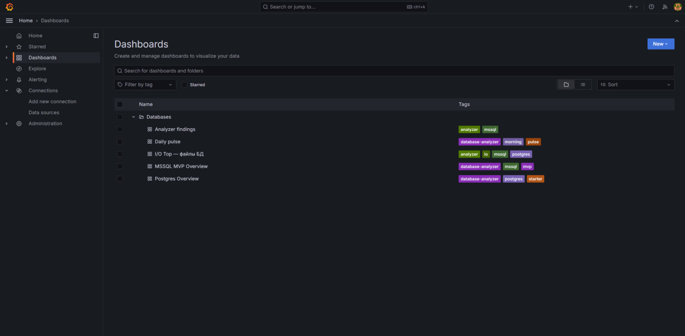
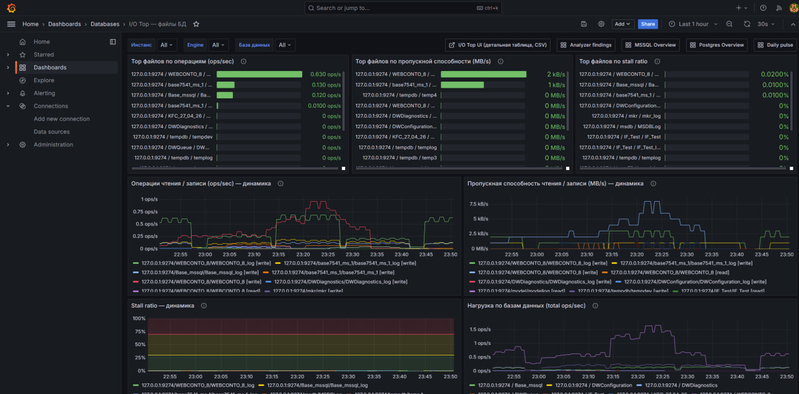
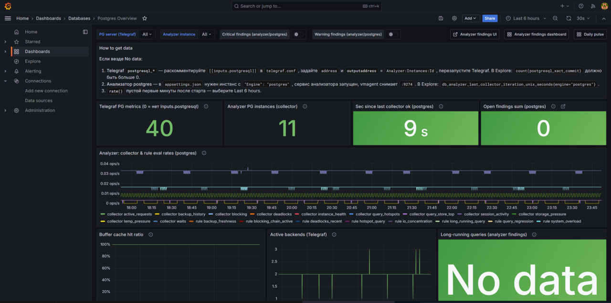
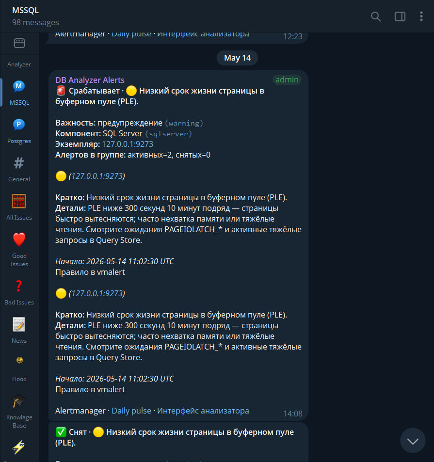
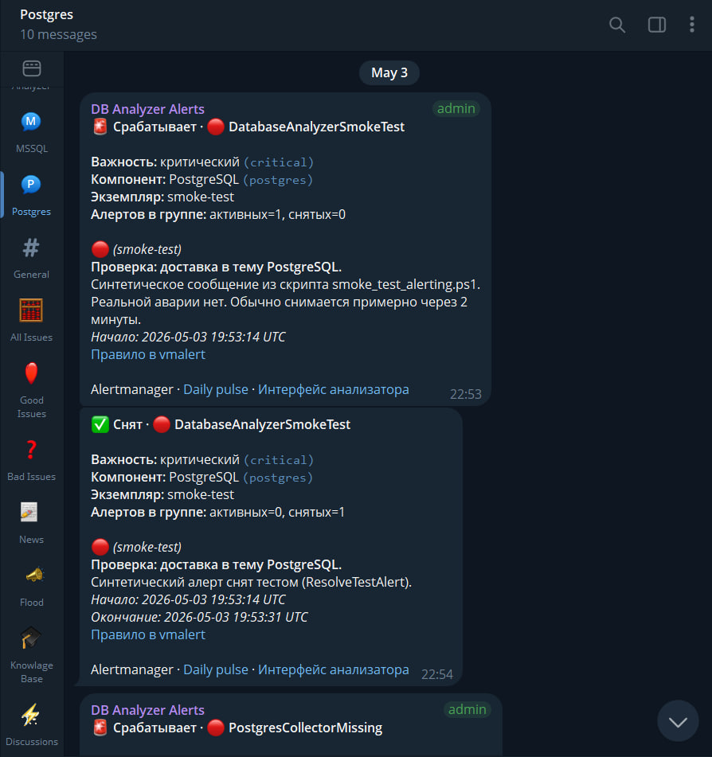

# DatabaseAnalyzer

DatabaseAnalyzer is a monitoring and diagnostic platform for Microsoft SQL
Server 2019 and PostgreSQL installations used with 1C:Enterprise. It combines a
standard observability stack with a custom .NET 8 analyzer that collects DMV and
Query Store snapshots, opens findings, exposes REST/UI endpoints, and maps SQL
load back to 1C operations and users.

The goal was practical: reduce MTTR for database incidents without installing
agents on client workstations or changing 1C application code.

Published with permission from the company owner. Metrics and screenshots are sanitized for portfolio use; source repositories remain private.

## Problem

In a 1C + SQL environment, "slow" can come from several layers at once: locks,
tempdb pressure, plan regressions, storage latency, background jobs, or errors in
the 1C technological journal. PerfMon and raw SQL counters show symptoms, but
they do not explain who triggered the load, which 1C operation was running, or
which SPID and SQL text were involved.

The project needed one operator path for live response (Grafana + Telegram) and
one drill-down path for deeper analysis (a web UI backed by historical snapshots).

## What I built

- A Windows-friendly observability stack: VictoriaMetrics, vmagent, vmalert,
  Alertmanager, Grafana, Loki, Promtail, and Telegraf.
- A self-contained .NET 8 analyzer service with collectors, a rule engine,
  SQLite WAL storage, REST endpoints, a vanilla JS UI, Prometheus metrics, and
  Alertmanager/Loki sinks.
- 1C correlation through technological journal parsing, SPID attribution, and
  optional RAS integration.
- PowerShell automation for bootstrap, service installation, smoke tests, HTTPS
  cutover, and CI artifact deployment.

## Architecture

## Scope and numbers

| Area | Shipped scope |
|------|---------------|
| Analyzer codebase | ~19k LOC, ~216 C# files, 12 projects (7 app + 5 test) |
| Diagnostic rules | 21 rules across SQL Server, PostgreSQL, and 1C journal signals |
| Alerts | 29 vmalert rules in 4 groups |
| Dashboards | 5 provisioned Grafana dashboards, ~52 panels |
| Snapshots | 11 MSSQL record types plus PostgreSQL equivalents where supported |
| API/UI | 20+ GET endpoints, CSV exports, 6 UI tabs |
| Metrics | ~30 `db_analyzer_*` Prometheus metrics |
| Operations | ~37 PowerShell scripts and 12 SQL setup scripts |

## Notable decisions

- Store analyzer history in SQLite WAL. It kept deployment simple on Windows and
  was enough for trend windows, findings, and snapshot inspection.
- Push findings both to Alertmanager and Loki. Alertmanager handles live routing;
  Loki keeps searchable context around the same events.
- Keep the 1C integration passive. The platform reads technological journal
  files and RAS/DMV data instead of requiring changes on each client machine.
- Treat Grafana as the operator surface and the analyzer UI as the investigation
  surface. This avoided turning one UI into a catch-all dashboard.

## Screenshots

<strong>Analyzer UI</strong>

<strong>Grafana dashboards</strong>

<strong>Telegram alert routing</strong>

## Stack

.NET 8, C#, SQLite WAL, VictoriaMetrics, vmagent, vmalert, Alertmanager, Grafana,
Loki, Promtail, Telegraf, PromQL, Serilog, PowerShell, WinSW, GitHub Actions,
Telegram Bot API, 1C RAS/TJ.
