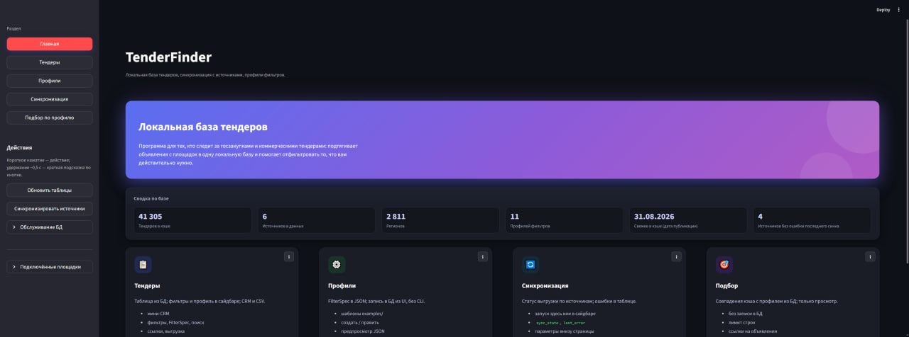
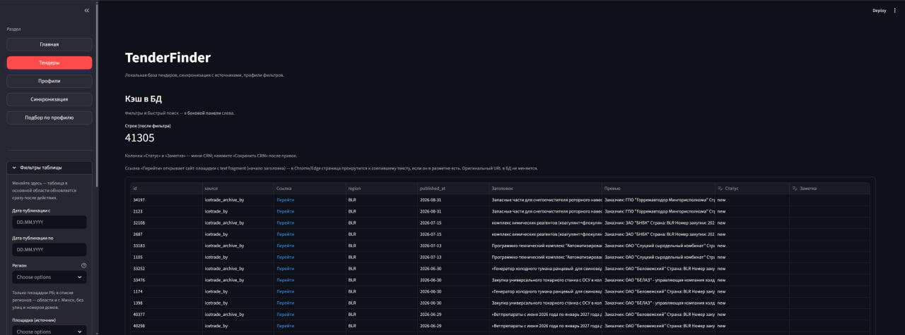
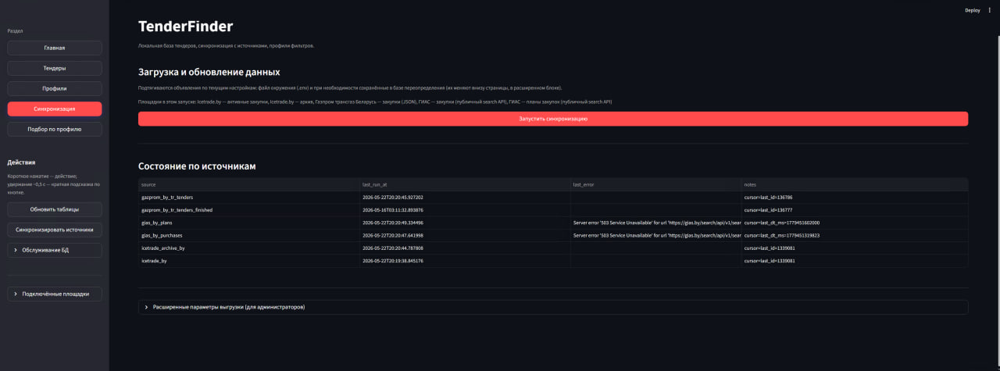
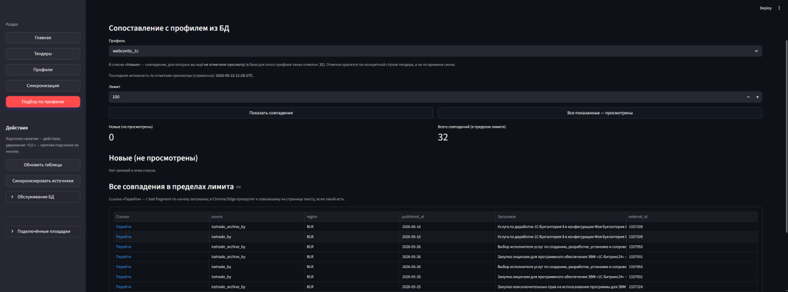

# TenderFinder

TenderFinder is a tender-monitoring system for the Belarus market. It collects
government and corporate procurement notices from several sources, normalizes
them into one model, stores them locally, matches them against configurable
profiles, and sends relevant results through Streamlit, REST, webhooks, and
Telegram.

The project was built for teams that take part in tenders and do not want to
manually check many procurement sites every day.

Published with permission from the company owner. Metrics and screenshots are sanitized for portfolio use; source repositories remain private.

## Problem

Tender data is split across different platforms: public procurement portals,
corporate sites, HTML tables, JSON APIs, and SPA search forms. Manual monitoring
takes time, but missed tenders cost real opportunities.

The system needed to fetch updates on schedule, keep a local cache, filter by
business profiles, and notify people without flooding Telegram on every sync.

## What I built

- Async ETL connectors for Belarus procurement sources, with a shared
  `TenderRecord` model and source-specific cursors.
- A SQLite cache with upsert and diff detection, so CRM fields are preserved and
  unchanged tenders do not generate noise.
- A Streamlit operator UI for search, profile matching, sync status, and CRM
  statuses.
- FastAPI endpoints for integrations and automation.
- Telegram delivery with forum topics, sync summaries, per-profile messages, and
  callback handling.

## Scale

| Metric | Value |
|--------|------:|
| Local tender cache | 41,307 records |
| SQLite database size | ~48 MB |
| Active data sources | 6 |
| Source connectors | 7 |
| Filter profiles | 11 |
| Python code | ~9,800 LOC |
| Tests | 114 pytest tests |
| CLI commands | 23 |
| REST endpoints | 6 |

## Data sources

The production setup included active connectors for Belarus procurement sources
and prepared adapters for sources that were either disabled or blocked by auth
requirements.

Each connector implements the same contract: fetch records since the last cursor,
normalize them, and return the next cursor. That kept the core engine independent
from individual website quirks.

## Filtering and delivery

Filtering is driven by Pydantic `FilterSpec` profiles:

- required and optional keywords;
- exclude lists;
- regions, sources, and date windows;
- plain substring matching and regex mode;
- industry templates for 1C, IT development, security, cloud/hosting, legal,
  accounting, construction, logistics, and other segments.

One production issue was repeated "changed tender" noise caused by fields that
were not meaningful to users. The smart diff layer compares platform fields
selectively and turns what could be tens of thousands of repeat messages into a
controlled notification stream.

## Screenshots

<strong>Streamlit UI</strong>

## Stack

Python 3.10+, AsyncIO, FastAPI, Streamlit, SQLAlchemy 2 async, aiosqlite, httpx,
Pydantic v2, BeautifulSoup4, Typer, pytest, Telegram Bot API, Cloudflare Tunnel,
Windows Task Scheduler.
