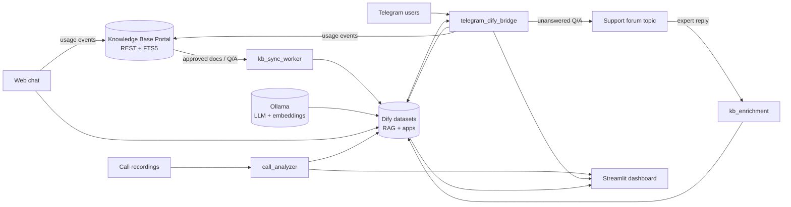

# AI Consultant

AI Consultant is the LLM-facing layer around Webconto's 1C consulting knowledge base.
It answers consultant and operator questions through **Telegram** and a **web chat**,
keeps a **Dify** dataset in sync with the approved content in the
[Knowledge Base Portal](webconto-kb.md), sends **usage telemetry** back to the portal,
and ships an operator **Streamlit dashboard** for bot quality, KB health, and call-center
analytics.

The [Knowledge Base Portal](webconto-kb.md) stays the source of truth for documents,
Q/A, audit, and review workflows. This project owns inference, retrieval, channels,
and the feedback loop into Dify.

Published with permission from the company owner. Screenshots are published with permission; sensitive repository and customer data are not disclosed. Source repositories remain private.

## Problem

Consultants need fast, grounded answers on 1C topics without treating the LLM stack as
the content database. Operators also need to see which materials actually help users,
which questions still miss good retrieval, and what shows up on support calls.

The system had to:

- serve RAG answers on Telegram and in a browser chat;
- enrich the knowledge base from expert replies when the bot could not answer;
- sync approved KB content to Dify without manual re-uploads;
- report retrieval usage back to the portal for hot/cold analytics;
- run call analysis (STT, optional diarization, LLM summaries) and surface KB gaps
  from real customer questions.

## What I built

- **Telegram ↔ Dify bridge** — blocking and streaming answers, session reset, admin
  commands, maintenance mode, broadcast, inline feedback, and forwarding of unanswered
  questions to a support forum topic.
- **KB enrichment from Telegram** — experts reply to forwarded "no answer" messages;
  the bot previews Q/A and upserts segments into Dify through the Segments API.
- **KB sync worker** — incremental pull of documents and Q/A segments from the portal
  REST API into local Dify datasets, with `kb_id ↔ dify_segment_id` mapping on disk.
- **Usage emitter** — after each answer, maps `metadata.retriever_resources` to portal
  usage events (with offline buffering when the KB API is unreachable).
- **Streamlit dashboard** — five sections: home, web chat, bot consultant analytics,
  KB operations, and call analytics (12 tabs on the calls side).
- **Call analysis pipeline** — faster-whisper STT, optional speaker diarization,
  LLM report generation (Dify app or Ollama), background job manager for batch runs,
  operator voice clustering, and KB-gap views derived from call questions.
- **Docker Compose** — packaged Telegram bridge and dashboard for repeatable deploys
  on a GPU-capable host; Dify and Ollama run beside the Python services.

## Architecture

Heavy inference (Dify, Ollama, STT/diarization) lives on a separate host from the
lightweight KB portal. The split is documented in the product repo as a two-repository
design: office KB stays online on a small VPS; the AI stack can be started on demand.

## Scope and numbers

| Area | Shipped scope |
|------|---------------|
| Python codebase | ~22k LOC (app + scripts, excluding tests) |
| Tests | ~680 pytest tests |
| User channels | Telegram bot, in-dashboard web chat |
| Dashboard | 5 sections; call analytics with 12 tabs |
| KB integration | Sync worker, usage emitter, review-draft queue hooks |
| RAG stack | Self-hosted Dify + Ollama (`qwen3.5`, `bge-m3` embeddings) |
| Call pipeline | STT, optional diarization, LLM reports, batch job manager |
| Deploy | Docker Compose for bridge and dashboard; env-driven Dify/Ollama URLs |

## Notable decisions

- **Two-repo boundary.** Approved content and audit history stay in the KB portal;
  Dify holds a working copy rebuilt from REST. That kept editorial workflow testable
  and avoided coupling content edits to GPU uptime.
- **Dual KB layers in Dify.** Markdown docs use `text_model` chunking by headings;
  expert Q/A pairs use `qa_model` segments with keyword-assisted retrieval for
  repeatable answers.
- **Shared JSONL telemetry.** `qa_history.jsonl`, `feedback.jsonl`, and
  `dify_metrics.jsonl` feed both Telegram and web chat, so dashboard metrics are
  channel-agnostic.
- **Calls inform KB gaps.** Call analytics includes "client questions" and
  "KB gaps" views so operators can close retrieval holes without guessing from chat
  logs alone.
- **Fail-soft portal sync.** Usage events buffer locally when the KB API is down
  instead of blocking user-facing replies.

## Screenshots

Screenshots for this project will be added under `docs/images/webconto/ai-consultant/`.
Suggested captures when ready:

- dashboard home (four entry cards);
- web chat with consultant answer and sources;
- bot consultant metrics / answer-quality tab;
- KB usage or review-draft view;
- call analytics overview or KB-gaps tab;
- Telegram support-topic enrichment flow (redacted).

<strong>Screenshots (placeholder)</strong>

_Add images here when available, for example:_

<!--  -->
<!--  -->

## Stack

Python 3.10+, Streamlit, httpx, Dify API, Ollama, python-telegram-bot, faster-whisper,
pyannote (optional diarization), Plotly, pandas, Docker Compose, pytest, GitHub Actions
(CI on main), Windows Task Scheduler / PowerShell ops scripts for bridge lifecycle.
