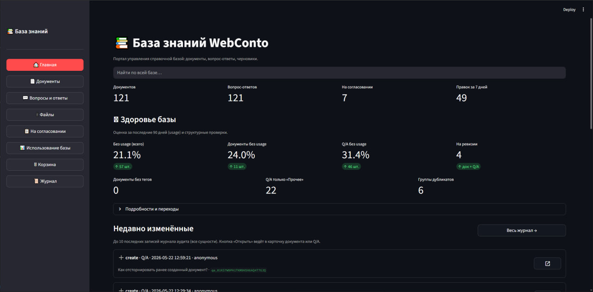
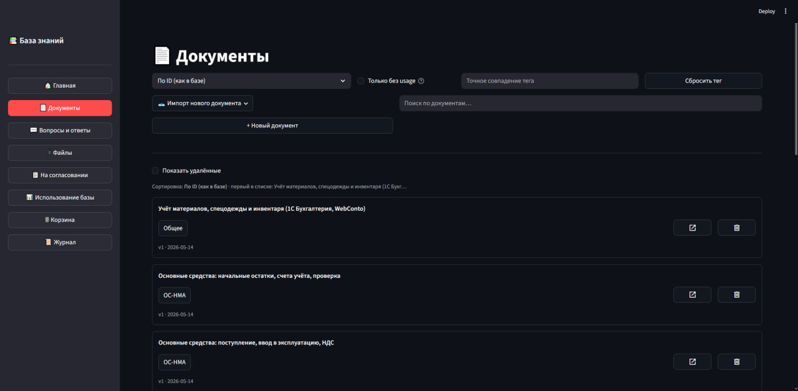
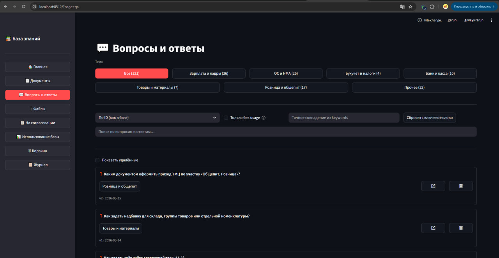

# Knowledge Base Portal

Knowledge Base Portal is an internal knowledge-base portal for 1C consulting materials. It
stores Markdown documents, question-answer pairs, attachments, drafts, audit
history, and usage analytics. It also acts as the source of truth for a separate
AI consultant service: the LLM layer reads approved content through REST and
sends usage events back to the KB.

Published with permission from the company owner. Screenshots are published with permission; sensitive repository and customer data are not disclosed. Source repositories remain private.

## Problem

Consultants and editors needed one place to maintain 1C reference materials:
documents, Q/A, PDFs, DOCX files, review drafts, and rollback history. The AI
bot should not own the content. It should read approved materials, suggest drafts
for review, and report which knowledge-base segments helped users.

The system also had to stay lightweight enough for an office VPS or a small
Docker host, without vector databases or embedding services inside this repo.

## What I built

- A FastAPI REST API for documents, Q/A, drafts, audit, metrics, usage events,
  health checks, and file archive operations.
- A Streamlit operator portal with 11 screens and route-like navigation through
  query parameters.
- SQLite WAL storage with FTS5 indexes for Cyrillic full-text search.
- Optimistic locking, soft delete, restore from trash, audit snapshots, and
  rollback from history.
- Attachment storage with SHA-256 deduplication and text extraction from PDF/DOCX
  files.
- Docker Compose deployment with the app, Cloudflare Tunnel, and hourly git
  backup of JSON dumps plus a compressed SQLite snapshot.

## Scope and numbers

| Area | Shipped scope |
|------|---------------|
| REST API | 40+ HTTP operations under `/api/v1/` |
| UI | 11 Streamlit screens |
| Search | SQLite FTS5 with `unicode61` tokenizer |
| Q/A taxonomy | 7 topic categories |
| Tests | ~170 pytest tests |
| Coverage target | >=85% for non-UI code |
| Deployment | Runs on small VPS/Docker hosts from 512 MB RAM |
| Usage ingestion | Idempotent batch API, 500 req/min default limit |
| Backup | Hourly git backup with JSON dumps and `kb.sqlite.gz` |

## AI-consultant boundary

The KB is intentionally boring infrastructure: it owns approved content,
versions, files, audit, and usage history. The AI consultant lives in a separate
project and talks to the KB over REST. This kept the content workflow testable
and prevented the LLM layer from becoming the database.

Implemented integration points include:

- dataset sync from KB to the LLM platform;
- usage event ingestion from the AI consultant back into the portal;
- portal analytics for hot, cold, and never-used materials.

## Screenshots

<strong>Knowledge-base portal</strong>

## Stack

Python 3.11, FastAPI, Pydantic v2, SQLite WAL, SQLite FTS5, Streamlit, Docker
Compose, Cloudflare Tunnel, supervisord, ULID, pytest.
